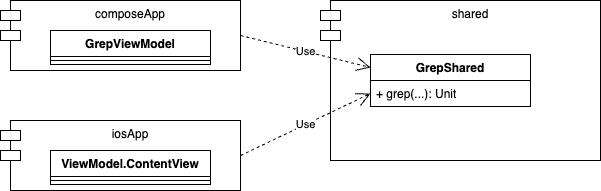

Kotlin Multiplatform App Tutorial
=================================

Kotlin Multiplatform アプリのチュートリアル集。

## KmpTutorial

### 概要

Android/iOS をターゲットとする Kotlin Multiplatform プロジェクトをお試しで作る際、本リポジトリのコードをベースとして使用されることを目的としている。  
本リポジトリは Kotlin Multiplatform の[公式チュートリアル](https://www.jetbrains.com/help/kotlin-multiplatform-dev/multiplatform-create-first-app.html) 実施後に README に記載したカスタマイズを実施している。

### Compose Multiplatform 要素を削除

[Kotlin Multiplatform Wizard](https://kmp.jetbrains.com/?_gl=1*1bk2vxi*_gcl_au*MTE4ODEwMDk0OS4xNzMyNDMxOTE4*FPAU*MTE4ODEwMDk0OS4xNzMyNDMxOTE4*_ga*MTg4MzY4NzgyNC4xNjgzOTY0MzAx*_ga_9J976DJZ68*MTczMzkyMDAwNC4xMjcuMC4xNzMzOTIwMDA4LjU2LjAuMA..) で 「Do not share UI (use only SwiftUI)」を選択してプロジェクトを作成性た場合でも、 Compose Multiplatform 要素が含まれてしまう。UI は Android/iOS 側でそれぞれ実装したいので、Compose Multiplatform 要素を削除した。

### ktlinter を導入

[ktlinter](https://github.com/jeremymailen/kotlinter-gradle)ラッパーを適用した。
以下の ktlint をコマンド実行すると composeApp モジュールと shared モジュールに lint を実行できる。

``` shell
# lint 実行
./gradlew lintKotlin 

# フォーマッター実行
./gradlew formatKotlin 
```

### ProGuard/R8 の適用

リリースビルドで [ProGuard/R8](https://developer.android.com/build/shrink-code?hl=ja) が適用される。

``` kotlin
    buildTypes {
        getByName("release") {
            isMinifyEnabled = true
            proguardFiles(getDefaultProguardFile("proguard-android.txt"), "proguard-rules.pro")
        }
    }
```

### shared モジュールの機能と I/F 

shared モジュールが持つ機能と、Android、 iOS の両OS モジュールへの I/F は以下。

|                  |I/F   |
|------------------|------|
|**データの grep機能**|関数  |
|**ロケット発射情報取得機能**|Use Case クラス  |
|**あいさつ文言取得取得機能**|ViewModel ライクなクラス  |


##### データの grep機能




##### ロケット発射情報取得機


##### あいさつ文言取得取得機能


#### shared モジュールに [Android 推奨アーキテクチャー](https://developer.android.com/topic/architecture?hl=ja)を適用


### Koin を導入

[Koin](https://insert-koin.io/) で DI する

###  Unit テストコード

UseCase の Unit テスト。

```kotlin
class CreatePhrasesUseCaseTest {
    private lateinit var useCase: CreatePhrasesUseCaseContract

    @Test
    fun testCreatePhrasesUseCase() {
        useCase = CreatePhrasesUseCase(FakeRecipeRepository())

        runTest {
            val phrases = useCase()
            assertEquals(phrases.size, 2)
            assertEquals(true, phrases[0].startsWith("Hello, Android 34!"))
            assertEquals(true, phrases[1].startsWith("There are only"))
        }
    }
}
```

Repository の Unit テスト。

```kotlin
class PlatformRepositoryTest {
    @Test
    fun testGetPlatformName() {
        val repository = PlatformRepository(FakePlatformSource())
        val platformName = repository.getPlatformName()
        assertEquals(true, platformName.isNotEmpty())
    }
}
```

### スクリーンショット

Android

     
  
iOS

 


## CmpTutorial

#### 概要

Android/iOS をターゲットとする Compose Multiplatform プロジェクトを作る際のベースとして使用されることを目的としている。  
Compose Multiplatform の[公式チュートリアル](https://www.jetbrains.com/help/kotlin-multiplatform-dev/compose-multiplatform-create-first-app.html) 実施後に以下のカスタマイズを加えている。

- composeApp/src/commonMain/ にある Greeting#greet を iOS プロジェクトから呼び出す

#### スクリーンショット

https://github.com/user-attachments/assets/b90d888b-100e-499e-977f-a2e1e9039ce1 

https://github.com/user-attachments/assets/dc5ef4d3-b018-4138-8dbf-ae37699135f1


